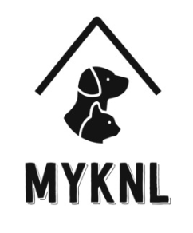

# MyKNL

[](https://opensource.org/licenses/IPL-1.0)

<p>
    
    
    
    
    
    
    
    
</p>

## Table of Contents

- [**Description**](#-description)
- [**Demo Video**](#-demo-video)
- [**Installation**](#-installation)
- [**Usage**](#-usage)
- [**License**](#-license)
- [**Author**](#-author)

## 📑 Description

**MyKNL** is here for you to make a reservation at your local pet hotels.  
If you need to be out of town for any reason without your dog?

We, **MyKNL**, the company of the team **Zzangu and the Pals**, are here to take care of your precious pup!! Easily sign up, add your pet, and make a reservation.

Hurry up!! The kennels are about to be fully booked soon!! Don't miss the amazing experience with us!

**CLICK THE LOGO TO EXPLORE OUR WEBSITE**  
[](https://myknl-zap.herokuapp.com/)

Below are the links for our proposal and presentation.

- Proposal Link: [**MyKNL Proposal**](https://docs.google.com/document/d/1oeiXWUtq-m31DlMHyNK1g9FK8J4q763C3GixPM8mxKc/edit?usp=sharing)
- Presentation Link: [**MyKNL Presentation**](https://docs.google.com/presentation/d/1rhb8wCvNMTrJTPZZ1ylaKObvnb1pCD_-xRjfb8RJT7E/edit?usp=sharing)

## 🎬 Demo Video

If you want to get an idea of how to explore our website?  
Check out our demo video below.

**CLICK THE IMAGE TO PLAY THE DEMO VIDEO**  
[](https://youtu.be/UE-s-nBnt44)

## 💾 Installation

Type and run **`npm i`** in your terminal to install the following dependencies.

- **`mysql`**
- **`mysql2`**
- **`express`**
- **`sequelize`**
- **`dotenv`**
- **`bcrypt`**
- **`js-datepicker`**

**Credits**: Thank's to [**js-datepicker**](https://www.npmjs.com/package/js-datepicker) for amazing date picker packages.

## 💻 Usage

Once you **`git clone`** this repository, make sure you create **`.env`** file in your cloned directory, and have following codes in your **`.env`**.

```
# local mysql credentials
DB_NAME=pethotel_db
DB_USER=
DB_PW=

# secret for signing cookies
SECRET=
```

**Notes**

- **`DB_NAME`**: the name of the database in **`./db/schema.sql`**
- **`DB_USER`**: the root user of your **`MySQL`** Database.
- **`DB_PW`**: the password of your **`MySQL`** Account.
- **`SECRET`**: the secret.

**(Optional)**
Type and run the following command to seed the example data. But not necessary.

- **`npm run seed`**

Finished all the steps above?  
Type and run following command in your terminal to start the server.

- **`npm start`**

## 🛠 License

This application is covered by the **ISC** license.

## 😎 Author

🖐 If you have any question about us or our project, feel free to contact us!

- **Jun Park**

  - [**Jun's Portfolio**](https://zzangu0215.github.io/portfolio/) (to be updated)
  - **Github**: [**zzangu0215**](https://github.com/zzangu0215)
  - Email: **tajo0215@gmail.com**

- **Israel Magallon**

  - [**Israel's Portfolio**](https://imagallon.github.io/portfolio1.1/) (to be updated)
  - **Github**: [**imagallon**](https://github.com/imagallon)
  - Email: **izzymagallonworks@gmail.com**

- **Vivianna Cowan**

  - [**Vivianna's Portfolio**](https://vivicowan.github.io/updated-portfolio/) (to be updated)
  - **Github**: [**vivicowan**](https://github.com/vivicowan)
  - Email: **vivicowan0@gmail.com**
